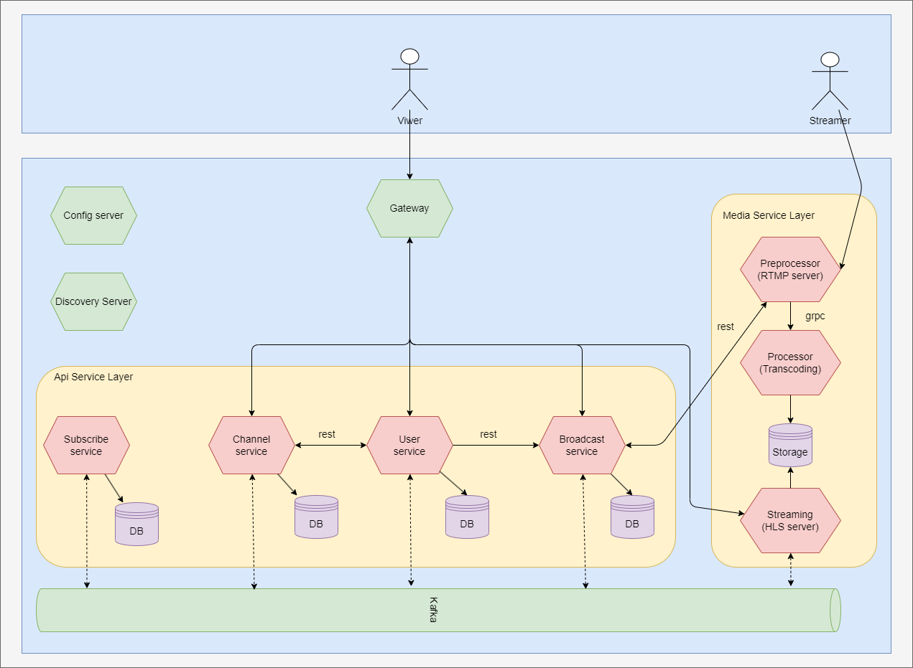

# my_stream

## 요구사항

  - 회원
    - 회원 등록
    - 모든 회원은 개인의 채널을 소유하고 방송을 할 수 있음
      - 모든 회원은 반드시 하나의 채널만을 소유 할 수 있음
    - 사용자(회원)은 채널 및 방송 관리를 위해 로그인/로그아웃 할 수 있음
    - 회원은 타 채널을 팔로일 및 팔로잉 취소를 할 수 있음
    - 회원은 타 채널을 비용을 지불하여 구독하거나 구독되어있는 채널에 대해 구독 취소 할 수 있음
  - 방송 시청
    - 시청자(회원/비회원)는 현재 방송중인 방송들을 검색할수 있음
      - 카테고리별로 현재 방송중인 방송들을 검색할 수 있음
      - 태그별로 현재 방송중인 방송들을 검색할 수 있음
    - 시청자(회원/비회원)는 방송을 시청할 수 있음
  - 방송 시작, 종료
    - 방송자(회원)는 자신에게 할당된 스트림키를 통해 방송 스트림을 전송하여 방송을 시작할 수 있음 
    - 방송자(회원)는 방송 스트림을 종료하여 방송을 종료 시킬수 있음
    - 방송자(회원)는 현재 송출하는 방송의 이름을 지정하거나 변경할 수 임음
      - 현재 송출하는 방송의 이름은 반드시 지정되어야 함
      - 방송의 이름은 50글자 미만으로 설정 가능
    - 방송자(회원)는 현재 송출하는 방송의 카테고리를 지정하거나 변경할 수 있음
      - 현재 송출하는 방송의 카테고리는 반드시 지정되어야 함
    - 방송자(회원)는 현재 송출하는 방송의 태그를 설정하거나 변경할 수 있음
      - 현재 송출하는 방송의 태그를 1개 이상이거나 아예 설정하지 않을 수 있음
      - 태그의 이름은 50글자 미만으로 설정 가능
  - 채널
    - 채널의 이름은 사용자의 이름으로 지정됨
    - 회원은 자신의 채널 정보 텍스트를 설정하거나 변경할 수 있음
      - 채널의 정보는 255 글자 미만으로 설정이 가능
    - 채널은 현재 및 이전 방송의 정보를 기록하고 있음
    - 채널은 자신을 팔로우한 회원들을 저장하고 있음
    - 채널은 자신을 구독한 회원들을 저장하고 있음
  - 구독
    - 회원은 타 채널을 구독할 수 있음
      - 구독은 1단계, 2단계 구독을 할 수 있음
    - 구독내역에 대해 기록되어야 함
    - 추후 구현

## Design

### Event Storming

### Context Map

### External Architecture

## Basic Sequence

### Create user

### Active & Deactive Stream

### Follow

## APIs

### mystream-user service

| name | method | path | decription | request body |
| -- | -- | -- | -- | -- |
| create | POST | /api/user/v1/user/new | create user | { "email": "test@gmail.com", "username":"user100", password : "ASDOWJSA" } |
| find | GET | /api/user/v1/user/{id} | find user | |
| updateUseProfile | PATCH | /api/user/v1/user/{id}/profile | change value of channel description | { "id": 100, "email" : "tesg1@gmail.com", "username" : "testg1" } |
| follow | PUT | /api/user/v1/following/follow | follow channel | { "userId" : 100, "channelId" : 105 } |
| unfollow | PUT | /api/user/v1/following/unfollow | unfollow channel | { "userId" : 100, "channelId" : 105 } |

### mystream-broadcast service

| name | method | path | decription | request body |
| -- | -- | -- | -- | -- |
| create | POST | /api/broadcast/v1/streams/new | create stream | { "id": 100, "username":"user100" } |
| find | GET | /api/broadcast/v1/streams/{id} | find stream | |
| search | GET | /api/broadcast/v1/streams/search | search stream | { "active": true, "categoryTitle" : "Cook", "hashTags" : ["Korean", "Cook"] } |
| active | PUT | /api/broadcast/v1/streams/active | active stream | { "streamKey" : "stream_100" } |
| deactive | PUT | /api/broadcast/v1/streams/deactive | deactive stream | { "streamKey" : "stream_100" } |

### mystream-channel service

| name | method | path | decription | request body |
| -- | -- | -- | -- | -- |
| create | POST | /api/channel/v1/channel/new | create channel | { "id": 100, "username":"user100" } |
| find | GET | /api/channel/v1/channel/{id} | find channel | |
| updateChannelDescription | PATCH | /api/channel/v1/channel/{id}/description | change value of channel description | { "title": "hello", "bannerImage" : "" } |
| follow | PUT | /api/channel/v1/channel/{id}/follow | follow channel | { "userId" : 100, "channelId" : 105 } |
| unfollow | PUT | /api/channel/v1/channel/{id}/unfollow | unfollow channel | { "userId" : 100, "channelId" : 105 } |

## Kafka events

| topic | body | decription
| -- | -- | -- |
| stream-active | { "streamId" : 100, "active" : true, "activeAt" : "xxxx"} | stream activated event
| stream-deactive | { "streamId" : 100, "active" : false, "activeAt" : "xxxx", "deactiveAt" : "xxxx"} | stream deactivated event
| stream-fallback | { "streamId" : 100 } | stream fallback event
